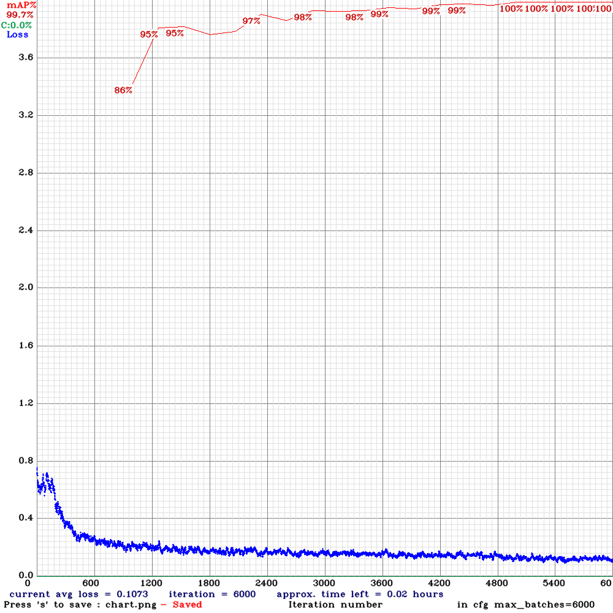

### This section presents a neural network model for object detection.

**Detection objects**: `Parking meter`

**Net**: `yolov4-tiny-3l`

**Size**: `416`

**mAP%**: `99.7`

**Chart**:

**Example**:

