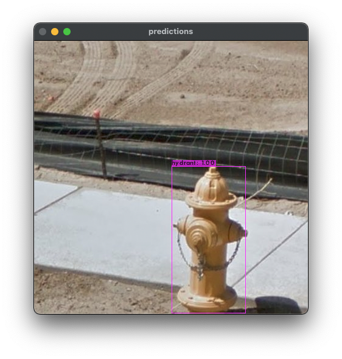

### This section presents a neural network model for object detection.

**Detection objects**: `Hydrant`

**Freebase ID**: `/m/01pns0`

**Net**: `yolov4-tiny-3l`

**Size**: `416`

**mAP%**: `100`

**Example**:

